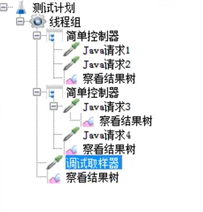
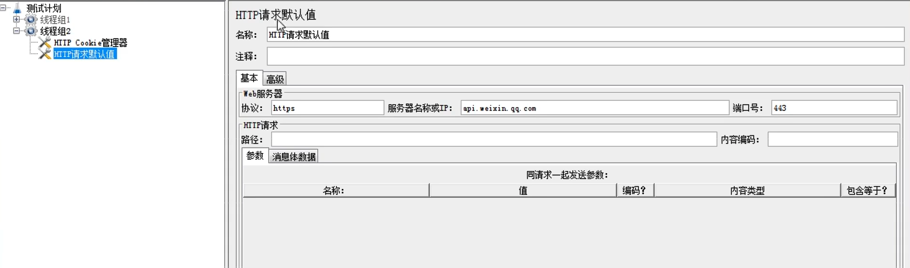
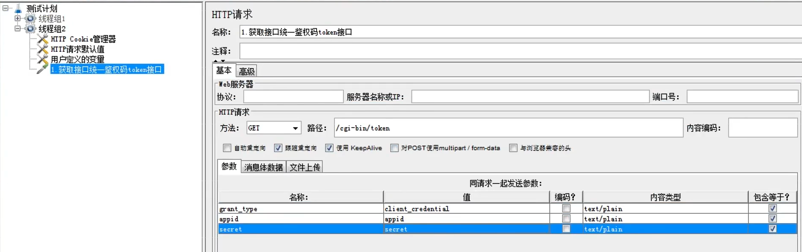
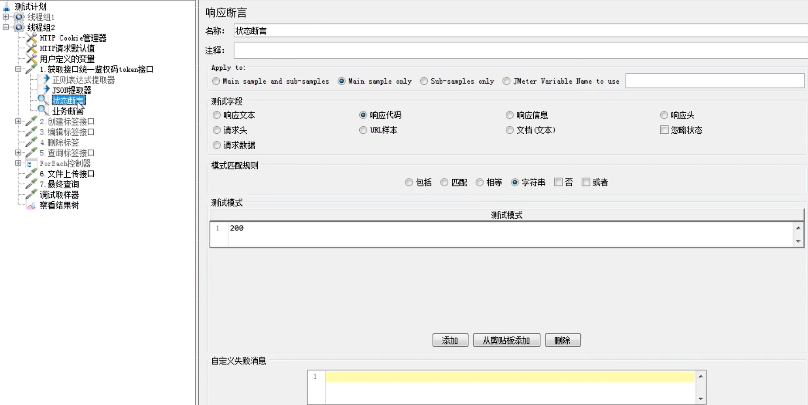
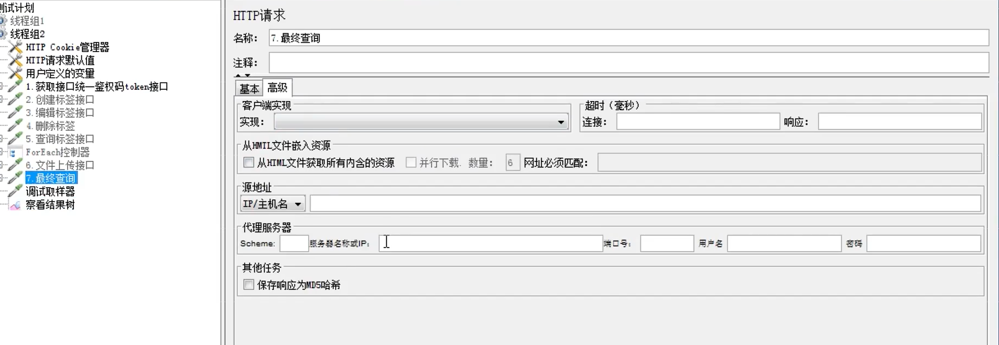
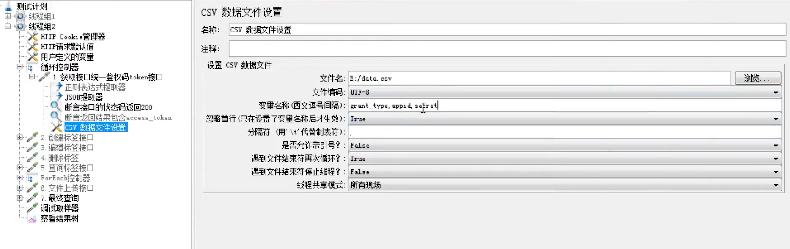
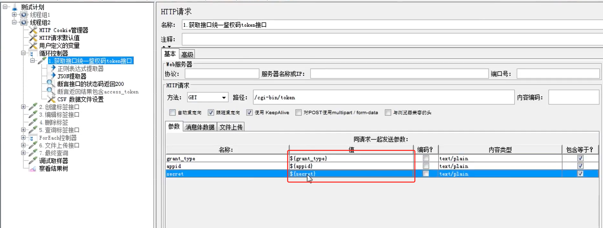
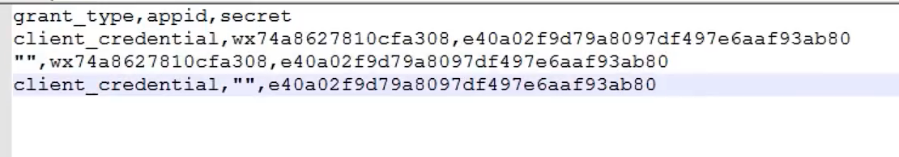
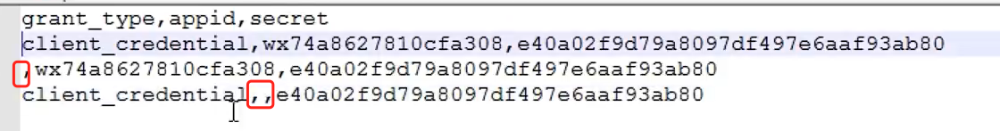

### 接口分类
+ 内部：开发的接口给内部系统使用
+ 外部：
  - 被测项目调用外部接口（正例）
  - 被测项目提供接口给外部使用（正例，返例，鉴权，兼容）
### 接口的设计风格分类
- 1、Soap
基于webservice协议，https://xxx?wsdl
- 2、RPC
基于dubbo（thrift）协议的接口，dubbo:xx//xx
- 3、RestFul
基于http协议，http://xx/xx
  http协议是一种超文本传输协议，是客户端与服务器交互数据。
  
  分为请求和响应两个部分。
请求：请求行（请求方式和请求路径），请求头，请求报文

    请求方式：get，post，put，delete
请求路径：url
请求头：
Accept: text/html,image/*                                            
浏览器可以接收的类型
Accept-Charset: ISO-8859-1                                      
浏览器可以接收的编码类型
Accept-Encoding: gzip,compress                              
浏览器可以接收压缩编码类型
Accept-Language: en-us,zh-cn                                
浏览器可以接收的语言和国家类型
Host: www.lks.cn:80                                               
浏览器请求的主机和端口
Referer: http://www.lks.cn/index.html                         
请求来自于哪个页面
User-Agent: Mozilla/4.0 compatible; MSIE 5.5; Windows NT 5.0   
浏览器相关信息
If-Modified-Since: Tue, 11 Jul 2000 18:23:51 GMT   
某个页面缓存时间
Cookie：                                                                    
浏览器暂存服务器发送的信息
Connection: close1.0/Keep-Alive1.1                          
HTTP请求的版本的特点
Date: Tue, 11 Jul 2000 18:23:51GMT                       
请求网站的时间
Allow:GET                                                                  
请求的方法 GET 常见的还有POST
Keep-Alive5                                                            
连接的时间；5
Connection：keep-alive                                             
是否是长连接
Cache-Control：max-age=300                                   
缓存的最长时间 300

响应：响应行(响应码和响应信息)，响应头，响应报文

接口测试工具
jmeter+ant+git+jenkins
postman+newman+git+jenkins

函数助手对话框
1、测试计划：jemeter的起点和容器
2、线程组：代表一定的虚拟用户
3、取样器：发送请求的最小单元
4、逻辑控制器：控制组件的执行顺序
5、前置处理器：在请求之前的操作
6、后置处理器：在请求之后的操作
7、断言：判断请求是否成功
8、定时器：是否延时或间隔发送请求
9、配置元件：请求期的配置信息
10、监听器：负责收集测试结果

执行顺序：
测试计划》线程组》配置元件》前置处理器》定时器》取样器》后置处理器》断言》监听器

定时器（
固定 ：每xx秒发送一次
同步 ：并发 
高斯 ：随机，模拟真实请求
）

作用域：
组件回作用域它的父级组件，同级组件以及同级组件的子组件

### 接口测试流程：
1、拿到接口文档（抓包，录制），熟悉接口业务，接口地址，鉴权方式，入参，出参，错误码，兼容

2、接口测试用例的设计评审
正例：
反例：
  + 1、鉴权反例（必填，错误，鉴权码过期）
  + 2、参数反例（必填，参数类型异常，参数长度异常）
  + 3、其他场景（黑名单，调用次数限制，分页场景）
  + 4、兼容性（一个接口对应多个版本App）

3、执行接口测试

4、团队协作，持续集成并伸出报告发送邮件  

### Jemeter 接口测试
#### 添加组件
1、HTTP Cookie 管理器：

2、HTTP请求默认值

3、用户定义的变量
#### 增加取样器
web服务器参数：会覆盖组件中的默认值，可以不写

自动重定向：假设响应是301/301只会获取最终的结果
跟踪重定向：假设响应是301/301会把整个过程的记录
#### 察看结果树

乱码：组件中增加编码格式utf-8或者设置全局配置文件中的编码格式utf-8

### jemeter接口关联
1、正则表达式提取器
添加一个后置处理器选择正则表达式提取器。
左边界右边界中间替换成（.*？）
$1$ 表示第一个正则表达式多个就写多个
匹配数字0随机-1所以x是第x个
2、jsonpath提取器（精准）
添加一个后置处理器选择jsonpath提取器。
$根目录 .子节点key
$[“key”]

接口测试实战（业务闭环） 
crud 创建了也删除了 数据库不产生测试数据
动态参数 tools 函数助手 random/
randomstring 

批量删除 循环
获取所有id -1 循环控制器 放入删除接口 增加固定定时器

### Jemeter断言
1、响应断言
- 状态断言
  
- 业务断言
json数据需要选择响应文本
字符串是需要选择文本

字符串、相等不支持正则
包含、匹配支持正则

2、json断言

3、beanshell断言

### Jemeter调试
1、调试取样器
2、jmeter + fiddler
高级里面 代理服务器 添加fiddler地址端口

### Jemeter数据驱动
添加一个元件，

如果多个数据，就需要循环三次
，这边没有值不能写“”需要这么写不然会报错

### 当没有接口文档时，如何使用Jmeter录制和创建脚本
1、抓包

2、badboy

3、jemter自带的http代理服务器
- （1）新建线程组
- （2）新建代理服务器：测试计划->非配置元件->代理服务器
  + 端口：8888
  + 目标控制器：设置为你录制的目标线程组
  type：默认httpclient 不行的话选 java
- （3）点击【启动按钮】，运行代理服务器
- （4）客户端设置：让客户端请求通过代理服务器发送，dns 中配置jemeter的端口