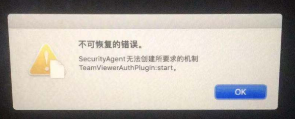

升级到 最新系统Catalina 后，卸载了TeamViewer ，重启电脑后，就开机不了了，恢复模式也不行。

升级到 最新系统Catalina 后，爆出tv有问题，就想卸了tv。用 cmm 卸载之后，由于要重启电脑，于是就近重启。结果重启后蹦出一个错误提示框
连登陆界面都不显示了，进安全模式也没有用，总之就是没法正常开机。后来进恢复模式，从朋友的 mac 上拷贝来 /Library/Security/SecurityAgentPlugins/TeamViewerAuthPlugin.bundle 才能够正常启动。
