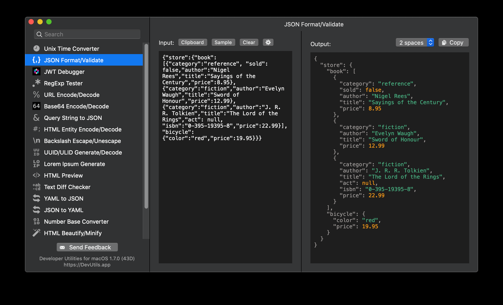
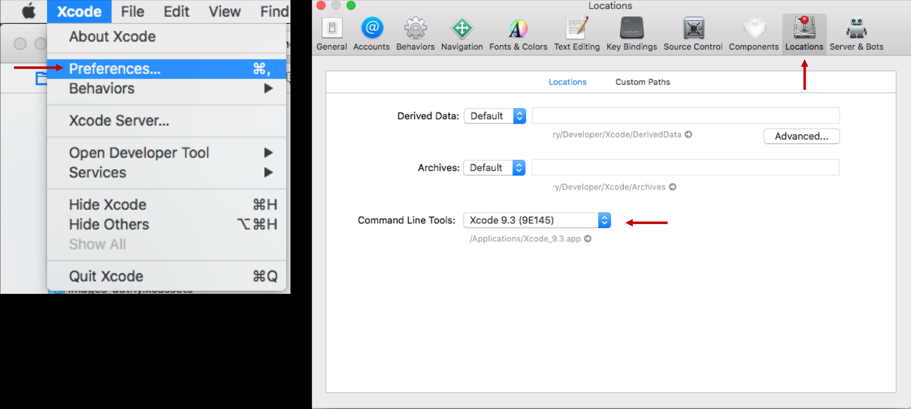
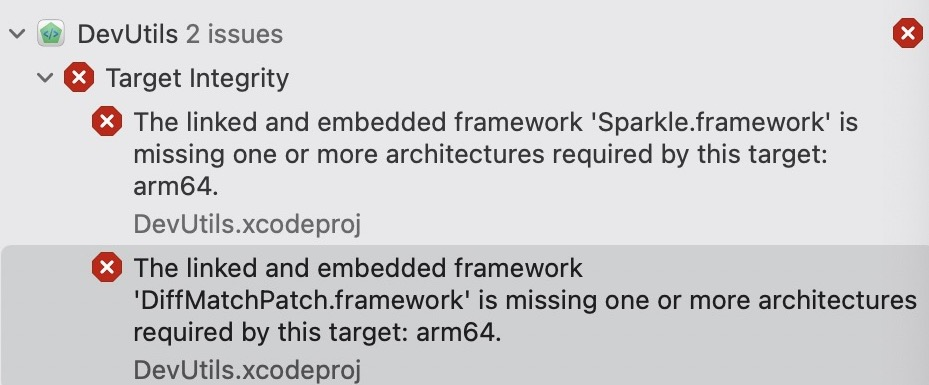
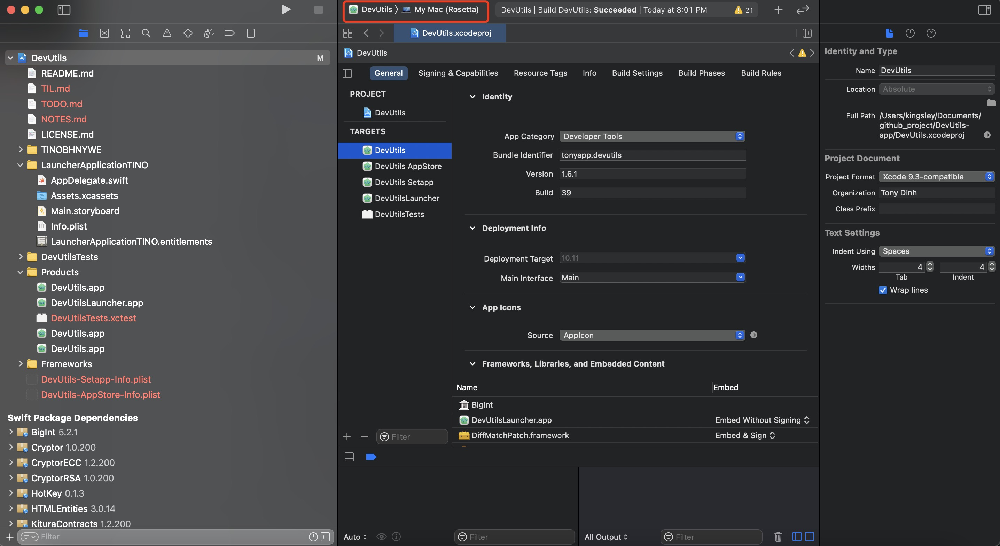

Developer Utilities for macOS

Format/Validate JSON, encode/decode Base64, convert timestamps, debug JWT… with just one click! Native macOS app, works offline, and open source.
这是一款付费开源的软件，他提供的编译版是收费的，自己编译就免费了。
于是自己编译吧。
附上地址:<https://github.com/DevUtilsApp/DevUtils-app>
开发环境:
This source code is a delayed version of DevUtils.

### Development environment

- Swift 5.1+
- Xcode 11.1+
- Swift Package Manager
- Carthage

### 编译说明

+ 克隆仓库到本地。

+ Bootstrap carthage, 这个是安装所需要的依赖:

```carthage bootstrap --platform macOS（不安装会报依赖找不到）```

+ 在Xcode中将签名团队更新为您的个人或组织团队。 这是在本地构建应用程序所必需的。 如果您在代码签名方面遇到问题，还请查看以下文章以查看是否有帮助：
  - <https://developer.apple.com/support/code-signing/>
  - <https://help.apple.com/xcode/mac/current/#/dev60b6fbbc7>
+ 在Xcode中跑起来。

### Bootstrap carthage 安装：
1.brew
安装carthage之前需要安装brew，进入官网(<https://brew.sh/index_zh-cn.html>) 有详细的安装步骤。
获取 Homebrew
打开终端Terminal，输入以下命令：
```xshell
/usr/bin/ruby -e "$(curl -fsSL <https://raw.githubusercontent.com/Homebrew/install/master/install>)"
```
获取最新版本
```brew update```
注意：如果遇到Error: The /usr/local directory is not writable.错误，就执行以下命令```sudo chown -R $(whoami):admin /usr/local```，再更新。

2.安装Carthage
安装brew之后，就可以安装Carthage了。
```brew install carthage```
安装Carthage之后，查看版本
```carthage version   //目前的版本号为0.15.2```
使用Carthage
进入项目所在文件夹
```cd ~/路径/项目文件夹```
创建一个空的carthage文件
```touch Cartfile```
此时项目文件夹中会有一个名字为Carthage的文件
使用Xcode打开该文件
```open -a Xcode Cartfile```
编辑Cartfile
```github "SVProgressHUD/SVProgressHUD" ~> 1.0```
Cartfile格式说明
依赖源Dependency origin
Carthage支持两种类型的源，一个是github，另一个是git。
github 表示依赖源，告诉Carthage去哪里下载文件。依赖源之后跟上要下载的库，格式为Username/ProjectName
git 关键字后面跟的是资料库的地址，可以是远程的URL地址，使用git://, http://, ssh://，或者是本地资料库地址。
依赖版本号 Dependency Version
告诉Carthage使用哪个版本，这是可选的，不写默认使用最新版本
```
== 1.0 表示使用1.0版本
>= 1.0 表示使用1.0或更高的版本
~> 1.0 表示使用版本1.0以上但是低于2.0的最新版本，如1.2，1.6
```
branch名称 / tag名称 / commit名称，意思是使用特定的分支/标签/提交，比如可以是分支名master，也可以是提交5c8a74a。
运行命令
```carthage bootstrap --platform macOS```
报了一个使用Carthage 错误 error: unable to find utility "xcodebuild", not a developer tool or in PATH
google 了一下发现要:

打开xcode 运行发现：

报错了，好像是没有这个包，可能是我💻是m1 芯片的原因，于是我修改成Rosetta运行：

成功了。将app拖到Application就好了。
